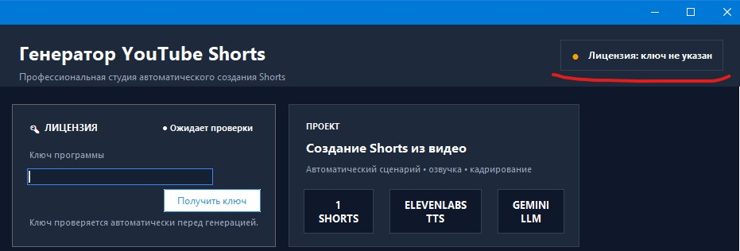
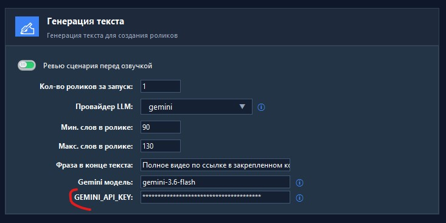
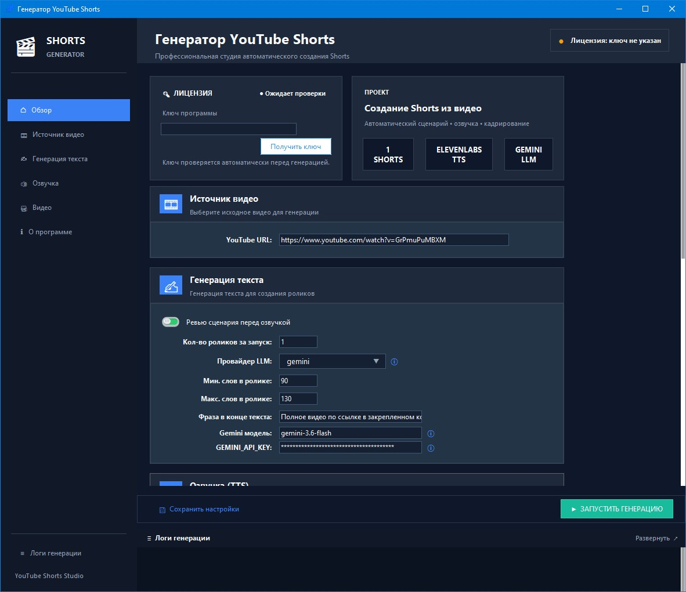

# Shorts Generator
## Руководство пользователя

*Версия программы: 1.0.0*

---

## Содержание

1. [О программе](#1-о программе)
2. [Системные требования](#2-системные-требования)
3. [Подготовка к работе](#3-подготовка-к-работе)
   - 3.1 [Получение ключа программы](#31-получение-ключа-программы)
   - 3.2 [Получение API-ключа Google Gemini](#32-получение-api-ключа-google-gemini)
   - 3.3 [Получение API-ключа ElevenLabs](#33-получение-api-ключа-elevenlabs)
4. [Обзор интерфейса](#4-обзор-интерфейса)
5. [Пошаговая инструкция по созданию Shorts](#5-пошаговая-инструкция-по-созданию-shorts)
6. [Описание всех настроек](#6-описание-всех-настроек)
   - 6.1 [Блок «Лицензия»](#61-блок-лицензия)
   - 6.2 [Блок «Источник видео»](#62-блок-источник-видео)
   - 6.3 [Блок «Генерация текста»](#63-блок-генерация-текста)
   - 6.4 [Блок «Озвучка (TTS)»](#64-блок-озвучка-tts)
   - 6.5 [Блок «Видео / кадрирование»](#65-блок-видео--кадрирование)
7. [Проверка сценария перед озвучкой](#7-проверка-сценария-перед-озвучкой)
8. [Логи генерации](#8-логи-генерации)
9. [Готовые ролики](#9-готовые-ролики)
10. [Частые проблемы и их решение](#10-частые-проблемы-и-их-решение)
11. [Поддержка и контакты](#11-поддержка-и-контакты)

---

## 1. О программе

**Shorts Generator** — программа для Windows, которая автоматически превращает одно длинное YouTube-видео в серию готовых вертикальных роликов формата Shorts/TikTok.

Вставьте ссылку на видео, нажмите одну кнопку — и через несколько минут получите набор полностью смонтированных Shorts: с озвученным сценарием, субтитрами и кадрированием под вертикальный формат 9:16.

Что программа делает автоматически:

- скачивает видео по ссылке;
- анализирует его содержание с помощью ИИ;
- находит самые интересные и законченные по смыслу моменты;
- генерирует сценарий и текст для каждого ролика;
- создаёт озвучку голосом ИИ;
- добавляет анимированные субтитры;
- кадрирует видео в вертикальный формат 9:16, удерживая лицо в кадре;
- монтирует и экспортирует готовые ролики.

📥 Скачать последнюю версию: https://github.com/Radomur/shorts_generator/releases/latest

---

## 2. Системные требования

- Операционная система: **Windows**.
- Стабильное подключение к интернету (видео скачивается по ссылке, а генерация текста и озвучки идёт через облачные сервисы).
- Аккаунты и API-ключи двух сервисов: **Google Gemini** и **ElevenLabs** (как их получить — см. раздел 3).
- **Лицензионный ключ** программы.

> Если в настройках выбран режим обработки видео «cuda» (см. раздел 6.5), для ускорения распознавания речи требуется видеокарта NVIDIA с поддержкой CUDA. Режим «cpu» работает на любом компьютере, но медленнее.

---

## 3. Подготовка к работе

Перед первым запуском нужно один раз настроить три вещи: лицензионный ключ, ключ Gemini и ключ ElevenLabs.

### 3.1 Получение ключа программы

Ключ программы (лицензия) нужен для активации Shorts Generator.

1. В разделе **«Лицензия»** нажмите кнопку **«Получить ключ»** — откроется страница, где можно приобрести или получить ключ.
2. Введите полученный ключ в поле **«Ключ программы»**.
3. Ключ проверяется автоматически при каждом запуске генерации — вводить его повторно каждый раз не нужно, программа сохраняет его в настройках.

Статус лицензии отображается в правом верхнем углу окна и в самом блоке «Лицензия»:

| Статус | Что означает |
|---|---|
| 🟠 Ожидает проверки / ключ не указан | Ключ ещё не введён или не проверялся |
| 🟡 Проверка ключа... | Идёт проверка в момент запуска генерации |
| 🟢 Ключ подтверждён | Ключ действителен, можно генерировать ролики |
| 🔴 Ошибка ключа | Ключ неверный — проверьте, что он введён без пробелов и опечаток |

### 3.2 Получение API-ключа Google Gemini

Gemini используется для анализа видео и написания сценариев роликов.

1. Перейдите на сайт **[Google AI Studio](https://aistudio.google.com/api-keys)**.
2. Войдите с помощью Google-аккаунта.
3. Создайте новый бесплатный API-ключ (**Create API Key**).
4. Скопируйте ключ и вставьте его в программу, в поле **«GEMINI_API_KEY»**:

### 3.3 Получение API-ключа ElevenLabs

ElevenLabs используется для создания озвучки роликов голосом ИИ.

1. Зарегистрируйтесь на сайте **[ElevenLabs](https://elevenlabs.io/?pscd=try.elevenlabs.io&ps_partner_key=YTJhNmQwYjhmMGZm&ps_xid=Xhl0CyLBXnLmP4&gsxid=Xhl0CyLBXnLmP4&gspk=YTJhNmQwYjhmMGZm)**.
2. В личном кабинете найдите раздел с API-ключами и создайте новый ключ.
3. Скопируйте ключ и вставьте его в программу, в поле **«ELEVENLABS_API_KEY»**.
4. При желании можно выбрать голос озвучки видео. Для этого откройте страницу в меню **[Voice](https://elevenlabs.io/app/voice-library)**, выберите понравившийся голос и скопируйте его **Voice ID** в соответствующее поле программы. Если вас устраивает голос по умолчанию, менять его не требуется.
> 💡 **Важно:** Чтобы использовать автоматическую озвучку, необходимо оформить **платную подписку ElevenLabs**. В большинстве случаев достаточно тарифа **Starter** стоимостью **6 $ в месяц**.

После того как все три ключа введены, программа полностью готова к работе.

---

## 4. Обзор интерфейса программы Shorts Generator

Окно программы состоит из нескольких частей:

- **Левая боковая панель** — разделы: «Обзор», «Источник видео», «Генерация текста», «Озвучка», «Видео», «О программе», а также кнопка «Логи генерации» внизу.
- **Верхняя строка** — название программы и статус лицензии.
- **Центральная часть** — карточки с настройками, сгруппированные по блокам:
  - Лицензия
  - Проект
  - Источник видео
  - Генерация текста
  - Озвучка (TTS)
  - Видео / кадрирование
  - О программе
- **Нижняя панель действий** — кнопки **«Сохранить настройки»** и **«▶ ЗАПУСТИТЬ ГЕНЕРАЦИЮ»**.
- **Панель логов** внизу окна — сюда выводится ход выполнения генерации, её можно разворачивать и сворачивать кнопкой «Развернуть / Свернуть».

Пункты левого меню — это быстрые «якоря», которые прокручивают центральную часть к соответствующему блоку настроек; все блоки на самом деле находятся на одной прокручиваемой странице.

Рядом со многими полями стоит значок **ⓘ** — нажатие на него открывает подсказку или ссылку на сайт нужного сервиса.

---

## 5. Пошаговая инструкция по созданию Shorts

1. Скачайте по [ссылке](https://github.com/Radomur/shorts_generator/releases/download/v1.0.0/install_shorts_generator.zip) и установите программу
2. Запустите программу.
2. Убедитесь, что в блоке «Лицензия» указан ваш ключ программы. Если ключа нет, то получите ключ в телеграмм боте по [ссылке](https://t.me/bux_click_key_bot)
3. Перейдите в блок **«Источник видео»** и вставьте ссылку на YouTube-видео (с которого вы хотите делать shorts-video) в поле **«YouTube URL»**.
4. Проверьте (или настройте под себя) параметры генерации текста, озвучки и видео — подробное описание каждого поля см. в разделе 6. Для первого запуска можно оставить значения по умолчанию.
5. Нажмите кнопку **«▶ ЗАПУСТИТЬ ГЕНЕРАЦИЮ»**.
6. Программа скачает видео, проанализирует его и подготовит сценарий(ы) для будущих роликов.
7. Если включена опция **«Ревью сценария перед озвучкой»**, программа приостановится и покажет текст сценария на проверку (см. раздел 7). Проверьте текст, при необходимости отредактируйте и нажмите **«✔ Продолжить»**.
8. Далее программа автоматически создаст озвучку, субтитры, смонтирует и кадрирует видео.
9. По завершении появится окно с результатами и списком готовых файлов (см. раздел 9). Ролики также сохраняются в папку **output** рядом с программой.

Ход всего процесса можно наблюдать в панели **«Логи генерации»** внизу окна.

---

## 6. Описание всех настроек

### 6.1 Блок «Лицензия»

| Поле | Описание                                                                                                      |
|---|---------------------------------------------------------------------------------------------------------------|
| Ключ программы | Ваш персональный лицензионный ключ, который можно получить в телеграмм [боте](https://t.me/bux_click_key_bot) |
| Получить ключ | Кнопка-ссылка для приобретения/получения ключа.                                                               |

### 6.2 Блок «Источник видео»

| Поле | Описание |
|---|---|
| YouTube URL | Ссылка на длинное YouTube-видео, из которого будут созданы Shorts. |

### 6.3 Блок «Генерация текста»

| Поле | Описание |
|---|---|
| Ревью сценария перед озвучкой | Переключатель. Если включён — перед тем как отправить текст в озвучку, программа покажет сценарий и даст его отредактировать (раздел 7). Если выключен — озвучка запускается сразу на сгенерированном тексте без остановки. |
| Кол-во роликов за запуск | Сколько отдельных Shorts нужно создать из одного видео за один запуск генерации. |
| Провайдер LLM | ИИ-модель, которая пишет сценарии и находит интересные моменты. Доступны **Gemini** (быстрее и дешевле) и **OpenAI** (обычно более высокое качество текста, но дороже). |
| Мин. слов в ролике / Макс. слов в ролике | Диапазон длины текста одного Shorts — задаёт границы, в которых ИИ должен уместить сценарий. Слишком короткий текст обрежет мысль, слишком длинный — не поместится в лимит длительности ролика (см. «Макс. длина ролика, сек» в разделе 6.5). |
| Фраза в конце текста | Обязательная фраза, которую программа добавит в конец сценария каждого ролика (например, призыв посмотреть полное видео по ссылке в закреплённом комментарии). |
| Gemini модель / Gemini API Key | Название конкретной модели Gemini и ваш API-ключ (см. раздел 3.2). Поля видны только если выбран провайдер «gemini». |
| OpenAI модель / OpenAI API Key | Аналогично, но для провайдера «openai». Поля видны только если выбран провайдер «openai». |

### 6.4 Блок «Озвучка (TTS)»

| Поле | Описание                                                                                                                                                                                                      |
|---|---------------------------------------------------------------------------------------------------------------------------------------------------------------------------------------------------------------|
| Провайдер TTS | Сервис синтеза речи. **ElevenLabs** — самые естественные голоса, лучшее качество, платный. **Edge TTS** — бесплатный, но качество очень низкое, ключ API не нужен. **OpenAI TTS** — низкое качество, платный. |
| Скорость финальной озвучки | Множитель скорости речи в готовом ролике (например, 0.92 — чуть медленнее обычного, 1.0 — обычная скорость).                                                                                                  |
| ELEVENLABS_API_KEY | Ваш API-ключ ElevenLabs (см. раздел 3.3). Видно только при выборе провайдера ElevenLabs.                                                                                                                      |
| ElevenLabs Voice ID | Идентификатор конкретного голоса из библиотеки голосов ElevenLabs.                                                                                                                                            |
| ElevenLabs модель | Модель синтеза речи ElevenLabs (например, eleven_v3).                                                                                                                                                         |
| OpenAI TTS модель / OpenAI TTS голос | Аналогичные параметры для провайдера OpenAI — видны только при его выборе.                                                                                                                                    |
| Edge TTS голос | Голос Microsoft Edge TTS — появляется автоматически при выборе провайдера Edge, ключ API не требуется.                                                                                                        |

### 6.5 Блок «Видео / кадрирование»

| Поле | Описание |
|---|---|
| Автоматически держать лицо в кадре | Переключатель «умного» кадрирования: программа сама следит за лицом говорящего и держит его в кадре при обрезке видео до вертикального формата 9:16. |
| Сила приближения видео | Степень зума при кадрировании (0–1). Чем выше значение, тем сильнее приближение к лицу/объекту. |
| Макс. длина ролика, сек | Максимальная длительность одного готового Shorts в секундах. |
| Качество распознавания речи | Размер модели распознавания речи (Whisper): tiny / small / medium / large. Чем больше модель — тем точнее субтитры, но дольше обработка и выше требования к ресурсам компьютера. |
| Использовать для обработки | Устройство для распознавания речи: **cpu** (процессор, работает всегда) или **cuda** (видеокарта NVIDIA, работает быстрее, но требует совместимой видеокарты). |

---

## 7. Проверка сценария перед озвучкой

Если в блоке «Генерация текста» включена опция **«Ревью сценария перед озвучкой»**, после того как ИИ подготовит текст, программа приостановит генерацию и откроет окно **«Проверка сценария»**.

В этом окне можно:

- прочитать и при необходимости отредактировать текст прямо в окне;
- нажать **«📋 Копировать»**, чтобы скопировать текст в буфер обмена;
- нажать **«💾 Сохранить TXT»**, чтобы сохранить сценарий в текстовый файл;
- нажать **«✔ Продолжить»** — генерация озвучки и видео продолжится с текущим (в том числе отредактированным) текстом;
- нажать **«✖ Отмена»** — генерация этого ролика будет прервана.

**Важно! Пока это окно открыто, фоновый процесс генерации ожидает вашего решения и не продолжает работу.**

---

## 8. Логи генерации

Панель **«Логи генерации»** внизу окна показывает текстовый журнал всех этапов работы программы: скачивание видео, обращения к ИИ, озвучку, монтаж и возможные ошибки.

- Кнопка **«Развернуть»** увеличивает панель логов на весь экран, кнопка **«Свернуть»** возвращает её к компактному виду.
- Если что-то пошло не так, в первую очередь стоит посмотреть последние строки в логах — там обычно указана причина ошибки.

---

## 9. Готовые ролики

По завершении генерации на экране появляется окно с итогами: сколько роликов создано и где они находятся.

Все готовые Shorts сохраняются в папку **`output`**, расположенную рядом с программой (файлом .exe / основным скриптом).

---

## 10. Пример работы программы

Ниже показан реальный пример работы **Shorts Generator**.

### Исходное видео

Из этого YouTube-видео: 👉 [https://www.youtube.com/watch?v=UGw2rbAs-n8](https://www.youtube.com/watch?v=UGw2rbAs-n8)

программа автоматически:

- проанализировала содержание всего видео;
- определила основную тему и смысл;
- выделила наиболее интересный и цепляющий фрагмент;
- подготовила сценарий на основе содержания видео;
- сгенерировала естественную озвучку;
- автоматически добавила субтитры;
- выполнила монтаж и подготовила готовый Shorts.

Главная задача программы — не просто вырезать случайный фрагмент, а создать **короткий ролик, который передаёт суть выбранного момента и вызывает интерес посмотреть полную версию видео**.

### Результат

🎬 [https://www.youtube.com/shorts/GCBIU4JK8Po](https://www.youtube.com/shorts/GCBIU4JK8Po)

Этот Shorts был автоматически создан из исходного видео всего за несколько минут.

| Исходное видео | Получившийся Shorts |
|----------------|---------------------|
|  |  |

Из одного длинного видео программа автоматически создала готовый Shorts с озвучкой, субтитрами и монтажом.

---

## 11. Частые проблемы и их решение

| Проблема | Возможная причина / решение |
|---|---|
| Статус лицензии — «Ошибка ключа» | Проверьте правильность ввода ключа программы (без лишних пробелов), а также подключение к интернету, так как ключ проверяется онлайн. |
| Генерация не запускается / кнопка неактивна | Дождитесь завершения предыдущей генерации — во время работы кнопка «Запустить генерацию» блокируется и меняет текст на «Генерация запущена». |
| Ошибка при обращении к Gemini/OpenAI | Проверьте, что API-ключ введён верно и на счёте сервиса достаточно средств/лимита запросов. |
| Ошибка при озвучке (ElevenLabs) | Проверьте API-ключ ElevenLabs и остаток символов озвучки на вашем тарифе. Попробуйте временно переключиться на бесплатный Edge TTS, чтобы убедиться, что дело именно в ElevenLabs. |
| Видео обрабатывается очень медленно | Уменьшите значение «Качество распознавания речи» (например, на «small» или «tiny»), либо, если есть видеокарта NVIDIA, переключите «Использовать для обработки» на «cuda». |
| Лицо периодически «выпадает» из кадра | Увеличьте значение «Сила приближения видео» или временно отключите «Автоматически держать лицо в кадре» и проверьте исходное видео. |
| Не приходит окно проверки сценария | Убедитесь, что переключатель «Ревью сценария перед озвучкой» включён. |

Если ни один из вариантов не помог, скопируйте последние строки из панели логов и обратитесь в поддержку (раздел 11) — это поможет быстрее найти причину.

---

## 12. Поддержка и контакты

Если у вас возникли вопросы по работе программы, предложения по улучшению или вы обнаружили ошибку, воспользуйтесь контактами ниже.

### Полезные ссылки

- 📺 **YouTube:** <https://www.youtube.com/@Smart_AutoClickers>
- 💬 **Telegram-канал:** <https://t.me/smart_autoclickers>
- 📥 **Скачать последнюю версию:** <https://github.com/Radomur/shorts_generator/releases/latest>
- 📩 **Техническая поддержка:** <https://t.me/vlad_qa_auto>

### Перед обращением в поддержку

Чтобы быстрее разобраться в возникшей проблеме, пожалуйста:

1. Проверьте раздел **10. Решение распространённых проблем**.
2. Сохраните последние логи генерации (кнопкой **💾 Сохранить TXT** или скопируйте их вручную).
3. Укажите версию программы (**О программе → Версия**).
4. По возможности приложите скриншот сообщения об ошибке.

---

## Shorts Generator

Программа для автоматического создания YouTube Shorts.

**Разработчик:** Smart AutoClickers

© 2026 Smart AutoClickers
